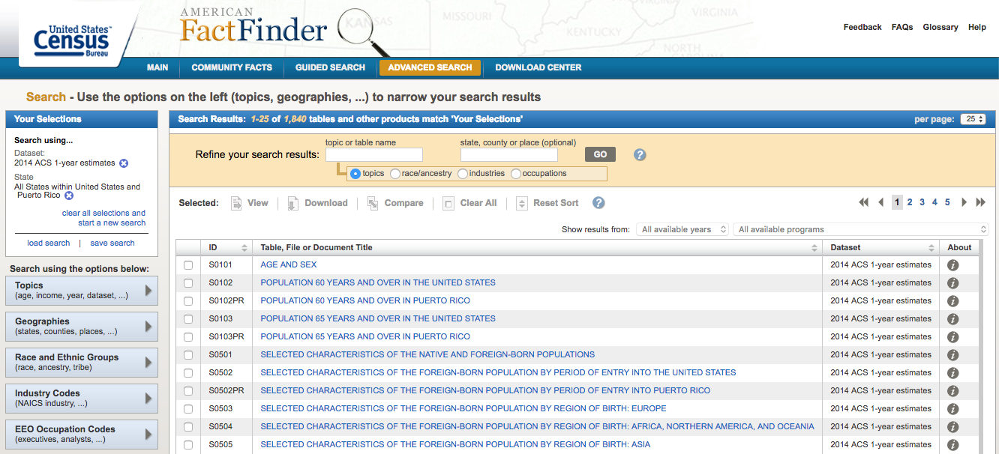

# Unit 16 | Assignment - Data Journalism and D3

<a target='_blank' href="https://giphy.com/gifs/newspaper-press-v2xIous7mnEYg">  <em>via GIPHY</em></a>

## Background

You're tasked with analyzing the current trends shaping people's lives, as well as creating charts, graphs and interactives to help readers understand your findings.  The editor wants to run a series of feature stories about the health risks facing particular demographics. 

#### 1. Find the Data

Look for demographic information using the 2014 one-year estimates from the U.S. Census Bureau's American Community Survey. 

* Topics -> Dataset -> 2014 ACS 1-year estimates
* Geographies -> Select a geographic type -> State - 040 -> All States within United States and Puerto Rico

Next, you'll search for data on health risks using 2014 survey data from the [Behavioral Risk Factor Surveillance System](https://chronicdata.cdc.gov/Behavioral-Risk-Factors/BRFSS-2014-Overall/5ra3-ixqq). 

To make sure you have a solid trend, you need to test for correlation with Excel's `=CORREL()` function. 

#### 3. Visualize the Data

Using the D3 techniques we taught you in class, create a scatter plot that represents each state with circle elements. 
* Note: You'll need to use `http-server` to display the graphic since you're pulling data in from a source outside of your app.js file.

#### 4. Embed into an iframe

When your `d3.html` displays the graphic just as you'd like it to, embed it in `index.html` with an iframe. Add a quick written analysis of your data below the graphic.

